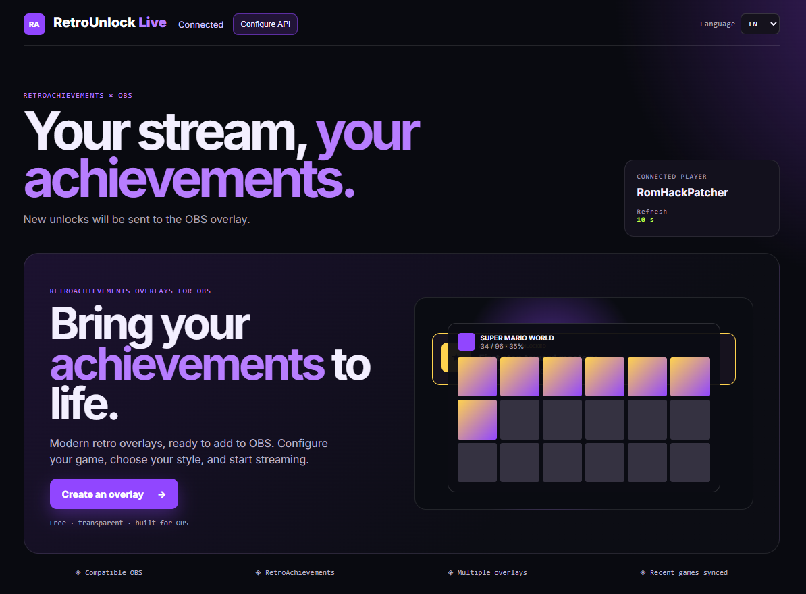
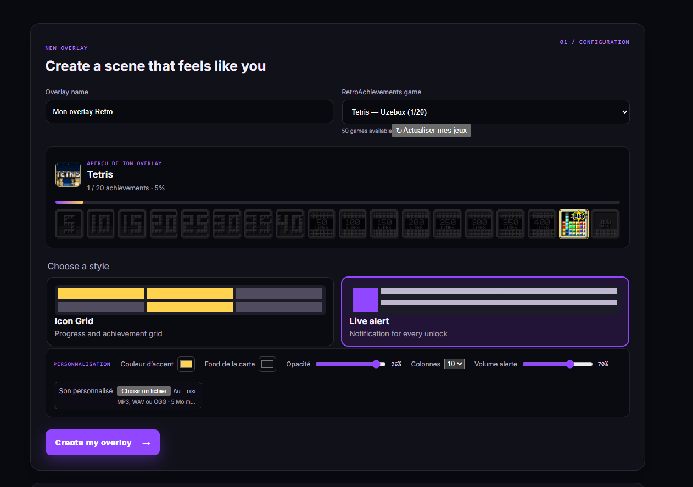
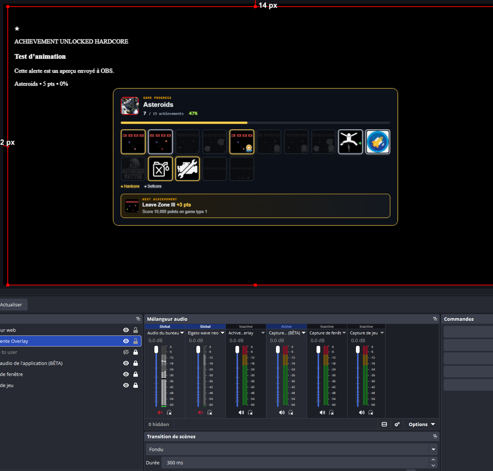

# RetroUnlock Live

**RetroAchievements overlays for OBS** free and open source.

Live unlock alerts, achievement icon grids, and a local Companion that runs on your PC. Your RetroAchievements API key never leaves your machine.

- **Download:** [romhackpatcher.com/tools/retro-unlock](https://romhackpatcher.com/tools/retro-unlock)
- **License:** PolyForm Noncommercial 1.0.0 (see [LICENSE](LICENSE))
- **Status:** Waiting for feedback. early prototype, active development

## What you get

| Overlay | What it shows |
| --- | --- |
| **Icon Grid** | Badges, progress bar, locked icons, points, next achievement |
| **Live Alert** | Popup + optional sound when an achievement unlocks |

Hardcore / softcore borders, custom colours, opacity, grid columns, multiple overlays per game.

### Dashboard

<p align="center">
  
</p>

### Create an overlay → use it in OBS

<table>
  <tr>
    <td width="50%" valign="top">
      
    </td>
    <td width="50%" valign="top">
      
    </td>
  </tr>
</table>

---

## Setup guide (Windows)

### Before you need

- **Windows 10/11**
- A **RetroAchievements** account
- Your **Web API key** (RetroAchievements → account settings → Web API)
- **OBS Studio** (only if you stream with overlays)
- **Node.js 20+** (LTS) — only if you run from source instead of the Windows app

---

### Option A — Windows app (recommended)

1. Download **RetroUnlock Companion** from [romhackpatcher.com/tools/retro-unlock](https://romhackpatcher.com/tools/retro-unlock)  
   *(The download button asks for Google sign-in; the product page does not.)*
2. Extract the ZIP, e.g. to `C:\RetroUnlock`.
3. Run **RetroUnlock Companion.exe**.
4. Click **Configurer l’API** / **Configure API**.
5. Enter your RetroAchievements **username** and **Web API key**, then save.
6. Wait until the status shows **connected**. Your recent games appear in the dashboard.

Keep the Companion open while you stream.

---

### Option B — Run from source

#### 1. Get the project

On GitHub: **Code → Download ZIP**, extract it (e.g. `C:\RetroUnlock-Live`), or:

```powershell
git clone https://github.com/YOUR-USERNAME/retrounlock-live.git
cd retrounlock-live
```

#### 2. Install

```powershell
npm install
```

#### 3. Configure

Copy `.env.example` to `.env` and open it in Notepad:

```env
RETROACHIEVEMENTS_USERNAME=YourRetroAchievementsUsername
RETROACHIEVEMENTS_API_KEY=paste_your_private_api_key_here
POLL_INTERVAL_MS=10000
PORT=3000
```

| Variable | Meaning |
| --- | --- |
| `RETROACHIEVEMENTS_USERNAME` | Your RA username |
| `RETROACHIEVEMENTS_API_KEY` | Your RA Web API key (private — do not share) |
| `POLL_INTERVAL_MS` | How often to check unlocks (default 10000 = 10s, minimum 5000) |
| `PORT` | Local dashboard port (default 3000) |

#### 4. Start

```powershell
npm start
```

Leave the terminal open. Open:

```text
http://localhost:3000
```

(Use your `PORT` if you changed it.)

---

### Build the Windows app yourself

```powershell
npm install
npm run build:win
```

The `.exe` is written to the build output folder. Private `.env` and overlay data are stored in your Windows user profile — not inside the app folder — so reinstalling does not ship your API key inside the package.

First launch: **RetroUnlock → Open configuration folder**, edit `.env`, restart the app.

---

## Create an overlay

1. Open the dashboard (`http://localhost:3000` or the Companion app).
2. Pick one of your **recent RetroAchievements games**.
3. Choose **Icon Grid** (progress) or **Live Alert** (popup on unlock).
4. Set name, colours, opacity, columns, optional alert sound.
5. Click **Create my overlay**.
6. On the new card, **copy the overlay URL**.

---

## Add the overlay to OBS

1. Open the OBS scene you want.
2. **Sources → + → Browser**.
3. Name it (e.g. `RetroAchievements Grid`) → **OK**.
4. Paste the overlay URL into the **URL** field.
5. Suggested size:
   - Icon Grid: **1100 × 750**
   - Live Alert: **800 × 250**
6. Optional: enable **Refresh browser when scene becomes active**.
7. **OK**, move/resize the source, and keep the Companion running.

**Test:** click **Test animation** / **Tester l’alerte OBS** in the Companion — it should appear in OBS right away.

---

## How it works

1. The Companion polls the RetroAchievements API for your unlocks (every `POLL_INTERVAL_MS`).
2. New unlocks are pushed to OBS Browser sources over a **local** connection (Server-Sent Events).
3. Grids refresh a few seconds after an unlock so badges update.
4. Game lists and grids are cached on your machine for speed.

Everything listens on `127.0.0.1` only.

---

> This is an independent community project and is not affiliated with RetroAchievements.

## Support the project

RetroUnlock Live is free and open source. If it helps your stream, you can support development on Ko-fi:

**[ko-fi.com/romhackpatcher](https://ko-fi.com/romhackpatcher)** ☕

Donations are optional the app stays free.

## Project status

**Waiting for feedback.** Early prototype under active development. Please open issues for bugs, ideas, or feature requests.

## License

This project is licensed under the **PolyForm Noncommercial License 1.0.0**.

You may use, modify, and redistribute this software for **noncommercial** purposes, subject to the terms of the license.

**Commercial use is not permitted** without a separate commercial license or written permission from the copyright holder.

Copyright © 2026 Charles Dionne.

Full license text: [LICENSE](LICENSE) · <https://polyformproject.org/licenses/noncommercial/1.0.0>
